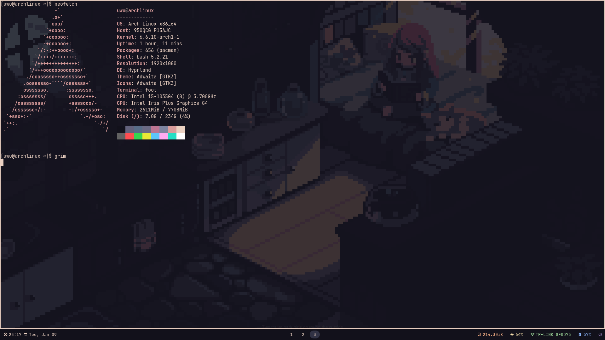
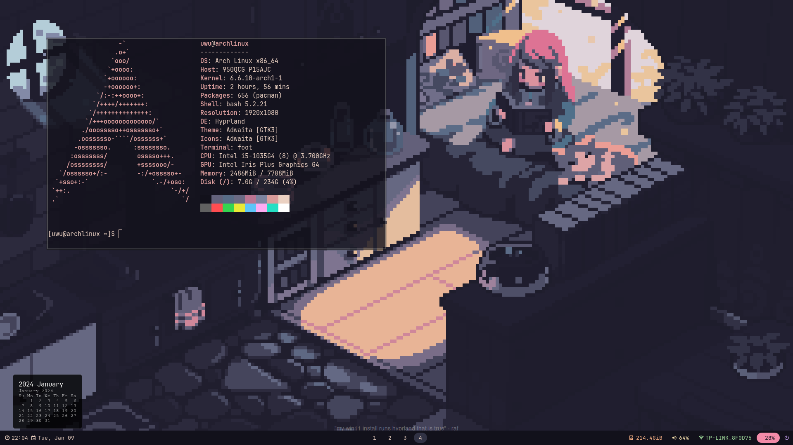

## Hey there! 
these are my config files for my GNU/linux distro :)!. 
## Features
<ul>
  <li><strong>OS:</strong> <a href="https://archlinux.org">Archlinux</a></li>
  <li><strong>WM:</strong> <a href="https://github.com/hyprwm/Hyprland">hyprland</a></li>
  <li><strong>Bar:</strong> <a href="https://github.com/Alexays/Waybar">waybar</a></li>
  <li><strong>Term:</strong> <a href="https://github.com/](https://codeberg.org/dnkl/foot)">foot</a></li>
  <li><strong>File manager UI:</strong><a href="https://wiki.archlinux.org/title/Dolphin"> dolphin (default)</a></li>
  <li><strong>App Menu:</strong>wofi</li>
</ul>
 

i use <a href="https://nvchad.com/docs/">NvChad</a> for neovim

#### Preview:

 

